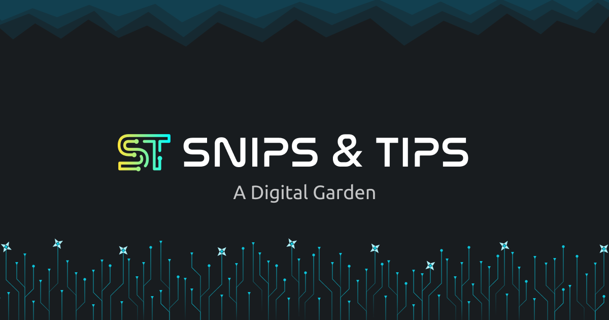

---
layout:
  title:
    visible: false
  description:
    visible: false
  tableOfContents:
    visible: true
  outline:
    visible: false
  pagination:
    visible: true
---

# Snips & Tips

<figure><figcaption></figcaption></figure>

Hello there,

Welcome to **Gautam's Digital Garden** - a place where creativity and knowledge thrive! This is where Gautam stores his brilliant ideas, code snippets, and definitions on a variety of topics, all in one place. It's like a treasure trove of information that he can always refer to. And the best part - you can explore it too!\
\
Now, you might be wondering why Gautam chose Gitbook for this incredible project. Well, the answer is simple - Gitbook provides an online editor where Gautam can easily write and publish his content. Plus, it syncs automatically with his GitHub repo [https://github.com/gautamnaik1994/Snips-and-Tips](https://github.com/gautamnaik1994/Snips-and-Tips), making it super convenient to manage. Gautam can create a local copy of the repository and push changes from his computer. Gitbook will then automatically synchronize that copy with the online version.

And let's not forget the awesome search feature provided by Gitbook, which allows you to easily find anything you're looking for in Gautam's repository.\
\
So, what are you waiting for? Dive into Gautam's Digital Garden and explore all the wonders it has to offer. And if you find any mistakes, don't hesitate to let Gautam know. Who knows, you might even submit a PR and become a part of this incredible project!

To know more about Gautam, visit his site [https://www.gautamnaik.com/](https://www.gautamnaik.com/)
