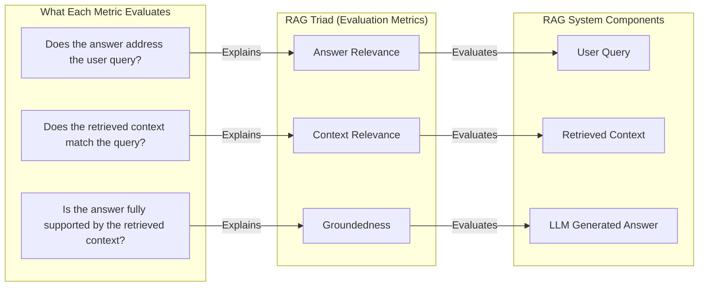

# Rag Evaluation

RAG application evaluation employs approaches depending on the availability/unavailability of Ground truth data.

Ground truth refers to the validated correct responses to user queries, also called gold answers. Multiple queries paired with their golden responses collectively form a Golden dataset, which shall be used as a benchmark to assess the quality of generated answers in RAG systems

A typical evaluation test case consist of,

* User query
* RAG generated response
* Baseline validated answer(optional)

To evaluate RAG, one among below two RAG evaluation frameworks shall be used:

1. RAG Triad
2. RAGAS (**Retrieval Augmented Generation Assessment**)

Both frameworks provide holistic evaluation by combining multiple distinct metrics to score the performance of a RAG pipeline’s retriever and generator.

**RAG Triad Metrics**:

* **Answer Relevanc**e : Measures how well the final response answers the original question, ensuring the answer is on-topic and appropriate.
* **Faithfulness** (Groundedness) : Assesses whether the generated answer is well-supported by the retrieved context, checks for hallucinations or unsupported claims.
* **Contextual Relevance** : Evaluates how relevant the retrieved context is to the original query.

**RAGAS Metrics**:

* **Answer Relevancy** : Measures how relevant the generated answer is.
* **Faithfulness**: Assesses the factual accuracy of the answer relative to the retrieved context.
* **Contextual Precision** : Evaluates the precision of the retrieved context\*.
* **Recall**: Measures the recall quality of the retrieved context\*.

Note that a Golden answer is needed to measure Contextual Precision and Recall; hence, RAGAS evaluation is recommended when Golden example(s) are available.

#### DeepEval

DeepEval is an open-source LLM evaluation framework that offers ready-to-use implementations of the metrics discussed above. Additionally, both generation and retrieval capabilities can be refined in order to improve and optimize evaluation scores. Next, we will evaluate our RAG architecture using the RAG Triad.

**Considering we do not have any Golden output.**

#### RAG Triad



| **Metric**                     | **What it Evaluates**                                                                                                                                                            | **Primary RAG Component it Checks**                |
| ------------------------------ | -------------------------------------------------------------------------------------------------------------------------------------------------------------------------------- | -------------------------------------------------- |
| Context Relevance              | The quality of the retrieval step. It checks if the text chunks fetched from the knowledge base are actually relevant to the user's input query.                                 | Retriever (e.g., Vector Database, Embedding Model) |
| Groundedness (or Faithfulness) | The quality of the generation step. It checks if the LLM's final answer is factually supported _only_ by the context provided by the retriever, guarding against hallucinations. | LLM/Generator                                      |
| Answer Relevance               | The final user experience. It checks if the final generated response directly and helpfully answers the user's original question, regardless of the retrieved context.           | LLM/Generator and Prompt Engineering               |

```python
from deepeval import evaluate
from deepeval.test_case import LLMTestCase
from deepeval.dataset import EvaluationDataset
from deepeval.metrics import AnswerRelevancyMetric, FaithfulnessMetric, ContextualRelevancyMetric
from deepeval.metrics import ContextualPrecisionMetric, ContextualRecallMetric

answer_relevancy = AnswerRelevancyMetric(
    threshold=0.7,
    model='gpt-4o',
    include_reason=True
)

#Groundedness
faithfulness = FaithfulnessMetric(
    threshold=0.7,
    model='gpt-4o',
    include_reason=True
)

contextual_relevancy = ContextualRelevancyMetric(
    threshold=0.7,
    model='gpt-4o',
    include_reason=True
)

test_case = LLMTestCase(
    input=user_query,
    actual_output=answer,
    retrieval_context=retrieved_context
)
results = evaluate(
    test_cases=[test_case],
    metrics=[answer_relevancy, faithfulness, contextual_relevancy]
)
```
