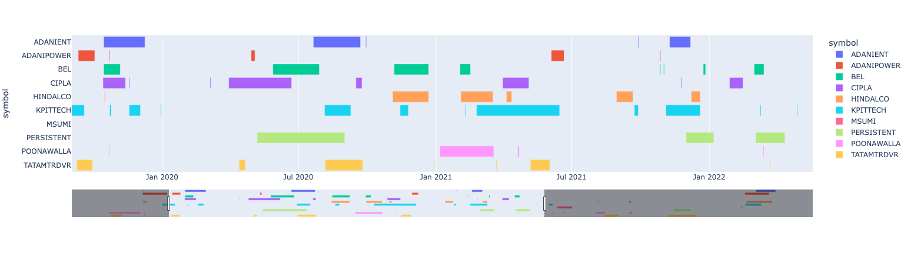

# Data Visualizations

## Dataviz library

* Pandas-Profiling
* Sweetviz
* Autoviz
* D-Tale

## Subplot syntax

### To plot 3 x 2 plots

```python
variables = ["Age", "Education", "Usage", "Fitness", "Income", "Miles"]

fig, axes = plt.subplots(2, 3, figsize=(20, 12))

for i in range(2):
    for j in range(3):
        variable = variables[i * 3 + j]
        sns.boxplot(ax=axes[i, j], data=df, x="Product", y=variable, hue="Gender")
        axes[i, j].set_title(f"Gender wise {variable} vs Product")

plt.show();
```

### Subplots using single line

```python
data.plot(kind='density', subplots=True, layout=(3, 3), sharex=False)
```

To generate box plot with solid background color

```python
colors = dict(boxes='lightblue', whiskers='dimgrey', medians='dimgrey', caps='dimgrey')
df.plot(kind='box', subplots=True, layout=(3, 4), sharex=False, figsize=(12, 15), patch_artist=True, color=colors);
plt.suptitle("Outliers", y=0.92, fontsize=14);
```

### Add a Pie chart inside the subplot

```python
unique_users["Gender"].value_counts(normalize=True )[:10].plot(kind="pie", autopct='%1.1f%%', startangle=90, ax=axes[1,0])
axes[1,0].set_title("Gender Distribution");
```

### Load top n values in seaborn countplot

```python
sns.countplot(x="Product_Category", data=df,
    order=df["Product_Category"].value_counts().iloc[:10].index)
```

## Plot a Gantt Chart using Plotly

|      | symbol     | buy\_date  | sell\_date | buy\_price  | sell\_price | quantity | days\_diff | profit |
| ---- | ---------- | ---------- | ---------- | ----------- | ----------- | -------- | ---------- | ------ |
| 1510 | PERSISTENT | 2023-04-25 | 2023-06-09 | 4448.000000 | 4860.000000 | 2.0      | 7 days     | 824.0  |
| 367  | BEL        | 2020-05-28 | 2020-07-29 | 21.390625   | 29.890625   | 467.0    | 16 days    | 3969.5 |
| 1593 | POONAWALLA | 2022-06-10 | 2022-06-13 | 247.750000  | 230.625000  | 40.0     | 29 days    | -685.0 |
| 493  | CIPLA      | 2021-11-24 | 2021-11-25 | 882.000000  | 888.500000  | 11.0     | 2 days     | 71.5   |
| 65   | ADANIENT   | 2022-05-31 | 2022-06-01 | 2166.000000 | 2148.000000 | 4.0      | 5 days     | -72.0  |

```python
import plotly.express as px

fig = px.timeline(dataframe, x_start="buy_date", x_end="sell_date", y="symbol", color="symbol")
fig.update_layout(xaxis_rangeslider_visible=True)
fig.show()
```



<figure><figcaption><p>Gantt Chart</p></figcaption></figure>

